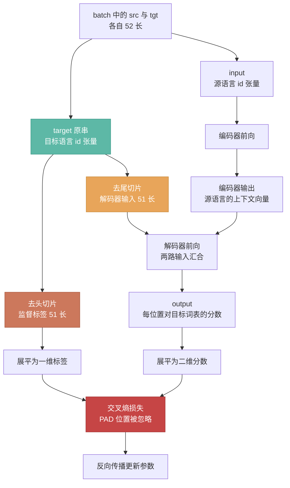

# Transformer 解码器的输入输出形式

> 围绕「解码器吃什么、吐什么、为什么这样切」展开：从论文的 shifted right 定义，讲到本仓库 `train.py` / `translate.py` 的真实调用链
> 关键词：shifted right, teacher forcing, 自回归, 交叉注意力, 因果掩码, exposure bias
> 生成日期：2026-09-13

---

## 起点：本次要回答的问题链

本次沉淀围绕下面这条问题链展开，**章节顺序即提问顺序**：

1. 编码器的输入是 `[batch, len_q, model_dim]`，**解码器的输入是什么**？
2. `train.py:96` 为什么用 `target[:,:-1]` 而不是 `target`？`target[:,1:]` 又是什么？
3. 代码里只把 `target[:,:-1]` 传进了 `model(...)`，**那 `target[:,1:]` 去哪了**？
4. 为什么**编码器的输出**要喂给解码器？
5. 训练和推理看起来是两回事，它们是什么关系？

第 1 问在第一章，第 2、3 问在第二章，第 4 问在第四章，第 5 问在第五章。第六章是本仓库的完整落地，第七章列出易混淆点，第八章给出全部结论的汇总。

---

## 一、解码器到底吃几路输入

### 1.1 准确定义

Transformer 解码器是一个**条件自回归序列生成器**（conditional autoregressive sequence generator）。它的输入不是一路，而是两路，来源完全不同：

| 路的名称 | 来源 | 在代码中的形参名 | 承担的角色 |
|---------|------|----------------|-----------|
| 目标侧输入（decoder input） | 目标语言句子的错位切片 | `target` | 提供"已经生成的前缀"，即自回归的历史 |
| 编码器输出（encoder output） | 源语言句子过完整个编码器的结果 | `encoded_input` | 提供条件信息，即要翻译的那句话 |

对应到本仓库 `model/decoder.py:45` 的方法签名：

```python
def forward(self, target, encoded_input, target_mask, input_mask):
```

形参 `target` 就是第一路，`encoded_input` 就是第二路。两者的差别不只是内容不同，**形状和数据类型也不同**（见 1.2）。

### 1.2 张量形状与数据类型

以本仓库的实际超参为准（`utils.py:47-57`：`d_model=256`、`n_heads=8`、`max_sent_len=50`，故 tokenize 后定长 $L = 50 + 2 = 52$）：

| 阶段 | 张量 | 形状 | dtype | 说明 |
|------|------|------|-------|------|
| 原串（未切片） | `target` | `[B, 52]` | `torch.int64` | 含 SOS/EOS/PAD 的完整序列 |
| **实际喂入解码器** | `target[:,:-1]` | `[B, 51]` | `torch.int64` | 去尾切片，见第二章 |
| 解码器输入（嵌入后） | 第一路 | `[B, 51, 256]` | `torch.float32` | 连续向量 |
| 源语言 id | `src` | `[B, 52]` | `torch.int64` | **只在编码器入口出现这一次** |
| 编码器输出 | `encoded_input` | `[B, 52, 256]` | `torch.float32` | **已是浮点向量，长度等于源句长度** |
| 输出 | `output` | `[B, 51, V_tgt]` | `torch.float32` | 长度跟随解码器输入，不是 52 |

关键差别有三条：

1. **`encoded_input` 进入解码器时已经是编码器算完的浮点表示**，而不是词 id。源语言的词 id 只在编码器的入口出现过一次（`model/transformer.py:42`），之后再不出现。
2. **两路的长度彼此独立**：`encoded_input` 的长度等于**源句**长度（52），解码器输入的长度等于**目标句**长度减一（51）。本仓库因为源和目标都按 `max_sent_len=50` 补齐，两者才恰好只差一；一般情形下（源 30 词、目标 80 词）可以差很多。
3. **输出长度跟随第一路而非第二路**：输出只在目标侧位置上产生，与源句长度无关。

### 1.3 白话翻译

把 1.1 定义里的术语逐条用具体数字拆开。

**"条件"** —— 指 $P(\text{目标句} \mid \text{源句})$ 里竖线右边那部分。源句是源语言的 id 序列（本仓库源语言为捷克语，目标语言为英语），形如 `[SOS, x₁, x₂, x₃, EOS, PAD, ...]`，定长 52。它的作用不是被预测，而是被"参考"——整句源句都会被交叉注意力读到。

**"自回归"** —— 指第 $t$ 步的输入包含第 $1$ 到 $t-1$ 步的输出。具体到本仓库推理时：第 1 步喂 `[SOS]`（1 个 id），第 2 步喂 `[SOS, I]`（2 个 id），第 3 步喂 `[SOS, I, love]`（3 个 id）——输入长度每步加一。

**"两路"** —— 模块 1：`target`，形状 `[B, 52]` 的整数张量。模块 2：`encoded_input`，形状 `[B, 52, 256]` 的浮点张量。两者在 `model/decoder.py:47` 和 `:51` 两个不同的注意力里分别被使用，不是拼在一起。

---

## 二、两张切片为什么是一对

### 2.1 切片的定义

本仓库 `tokenizer.py:16-25` 构造的序列形式为：

```python
token = [dict.SOS_TOKEN]
token += [dictionary.word2index[word] for word in sentence.split(' ')]
token.append(dict.EOS_TOKEN)
token += [dict.PAD_TOKEN] * (MAX_LENGTH - len(split_sentence))
```

即 `[SOS] + 词 + [EOS] + [PAD]*补足`，总长恒为 $L$。以下用 $L = 52$ 演示，假设目标句为 `I love you`：

| 下标 | 0 | 1 | 2 | 3 | 4 | 5 | 6 | ... | 51 |
|------|---|---|---|---|---|---|---|-----|-----|
| `target` | SOS | I | love | you | EOS | PAD | PAD | ... | PAD |

两张切片：

| 切片 | 取的下标范围 | 结果 | 长度 |
|------|------------|------|------|
| `target[:, :-1]` | $[0, 50]$ | `[SOS, I, love, you, EOS, PAD, ..., PAD]` | 51 |
| `target[:, 1:]` | $[1,51][1, 51]$ | `[I, love, you, EOS, PAD, PAD, ..., PAD]` | 51 |

两者长度相同、内容差一位，故称"一对"。

### 2.2 位置对齐关系

| 位置 $i$ | 输入 `target[:,:-1][i]` | 标签 `target[:,1:][i]` | 模型在该位置的任务 |
|---------|------------------------|----------------------|------------------|
| 0 | SOS | I | 看到 SOS，预测第 1 个词 |
| 1 | I | love | 看到 SOS I，预测第 2 个词 |
| 2 | love | you | 看到 SOS I love，预测第 3 个词 |
| 3 | you | EOS | 看到前 4 个，预测句子结束 |
| 4 | EOS | PAD | 预测结果被 `ignore_index` 丢弃 |

一般规律（$t$ 为输出位置，即"谁在预测"）：

$$\text{输出位置 } t \text{ 能看到} = \text{答案的前 } t \text{ 个词}, \qquad \text{它预测的是} = \text{第 } t+1 \text{ 个词}$$

注意 **$t$ 始终指"正在预测的那个位置"，被预测的词落在它后一位**。不写成"位置 $i$ 的预测"，因为那样读不出 `i` 指的是"谁在预测"还是"在预测谁"。

### 2.3 为什么必须错开：copy 问题

若不做错位，即把 `target` 原样作为解码器输入、也原样作为标签：

- 位置 $i$ 的输入中包含 `target[i]`
- 因果掩码允许位置 $i$ 看到位置 $0 \ldots i$
- 于是 `target[i]` 对位置 $i$ 是**可见的**
- 而标签恰好也是 `target[i]`
- 模型只需学恒等映射（把输入照搬到输出）即可使损失归零，**不产生任何有用的表示**

这类退化解被称为 copy 问题。错位一位后，位置 $i$ 能看到的最大下标是 $i$，而要预测的是下标 $i+1$，两者不重合，恒等映射不再可行。

### 2.4 为什么两端各砍一个

配对规则只有一条：**输入位置 $t$ 要预测的那个词，就放在标签位置 $t$ 上。**

换成下标说更死板：输入位置 $t$ 装的是 `target[t]`，标签位置 $t$ 装的是 `target[t+1]`，两者差一位——这就是"错开"的来源。措辞上注意**做预测的是输入位置，标签只是答案**；写"标签位置要预测的词"是把主语搞反了。

两张切片都由这一条规则推出来。

**先定标签——SOS 不可预测。** 它是人为插进去的起点，不是句子内容，任何句子开头都是它，不存在"预测 SOS"这个任务。所以标签从第 1 个词开始，也就是 `target` 去掉开头：

```
target         : SOS  I  love  you  EOS  PAD ...
target[:, 1:]  :      I  love  you  EOS  PAD ...     ← 长度 L-1
```

**再定输入——输入的最后一个位置没有对应的标签。** 上一步定下标签的内容是 `target[1]` 到 `target[L-1]`，共 $L-1$ 个，占据标签位置 $0 \ldots L-2$。按配对规则，输入位置 $t$ 装的是 `target[t]`，位置范围同样是 $0 \ldots L-2$，所以输入内容只到 `target[L-2]` 为止：

```
target          : SOS  I  love  you  EOS  PAD ...
target[:, :-1]  : SOS  I  love  you  EOS  PAD ...    ← 长度 L-1
```

两张切片并排看：

```
下标:    0     1     2      3     4     5  ...  50    51
target: SOS    I   love   you   EOS   PAD  ...  PAD   PAD

输入     [─────────── 下标 0 ~ 50，共 51 个 ───────────]
标签        [────────── 下标 1 ~ 51，共 51 个 ──────────]
```

下标 0 只出现在输入里，下标 51 只出现在标签里，中间的 50 个两边都有。**这就是"两端各砍一个"的由来——不是从原串上砍一刀，而是两张切片各自少了一头。**

| 切片 | 少了哪一头 | 为什么 |
|------|-----------|--------|
| 输入 `target[:,:-1]` | 末尾下标 51 | 它的后面已经没有标签了，留着它输入就比标签多一位，预测数和标签数对不上 |
| 标签 `target[:,1:]` | 开头下标 0 | 那是 SOS，不是句子内容，没有对应的预测任务 |

**如果两边都从同一头砍会怎样：**

| 做法 | 结果 |
|------|------|
| 都砍开头（都取 `[1:]`） | 输入变成 `[I, love, you, EOS, ...]`，起点不再是 SOS，位置 0 成了"看到 I 猜 love"——SOS 白加了，而 `EOS` 之后那位无人预测 |
| 都砍末尾（都取 `[:-1]`） | 标签里含 SOS，等于要求模型预测"句子的第 0 个词是 SOS"；且 EOS 永远拿不到监督信号，模型学不会什么时候该停 |

### 2.5 白话翻译与三处易读歪的点

> 本节除了白话拆解，还收了两个容易读歪的概念（"进模型"vs"当标签"、"一次调用 ≠ 一个预测"）。标题仍按白话层的约定保留"白话翻译"，但内容比纯白话多。

**"错开一位"具体错在哪** —— 不是两行之间错开，而是**同一行的两张视图错开**。行 0 和行 1 各自独立地把自己的 SOS 去掉、把自己的 EOS 挪进标签位。两行之间无任何耦合关系。

**"进模型"和"当标签"的区别** —— 直接看代码。`train.py` 里这四行是挨在一起的：

```python
# 题目：整个切片一次性进模型
output, _ = model(input, target[:,:-1])   # 输出 [B, 51, V_tgt]

# 答卷：模型的产出摊平
output = output.contiguous().view(-1, output.shape[-1])   # [B*51, V_tgt]

# 标准答案：切片不进模型，只在这里被赋值
target = target[:,1:].contiguous().view(-1)   # [B*51]

# 批改：答卷与标准答案在这一行碰头
loss = criterion(output, target)
```

`target[:, 1:]` 从头到尾没出现在 `model(...)` 的实参里。两张切片真正碰头的位置是最后那行损失函数，不是模型入口。

**这里要补一个容易漏掉的概念：一次调用 ≠ 一个预测。**

上面"题目"的说法有个坑——容易读成"模型看完整片切片，在末尾吐出一个预测"。实际不是：

- 喂进去的是 51 个位置，**一次性全给**
- 产出的也是 51 个预测，**每个位置各一个**，不是只有末尾那一个
- **每个输出位置只看得到它自己和它左边的输入位置**——这是因果掩码保证的

把第二条拆开看。`output` 的形状是 `[B, 51, V_tgt]`，取单个样本 `output[0]` 得 `[51, V_tgt]`：

| 维度 | 大小 | 含义 |
|------|------|------|
| 第 1 维 | 51 | 位置数——每个位置一行 |
| 第 2 维 | `V_tgt` | 词表大小——每行对词表里**每一个词**各打一个分 |

**每行装的不是一个词，是一整行分数。** 用一个 6 词的小词表走一遍（`index: 0=PAD, 1=SOS, 2=EOS, 3=I, 4=love, 5=you`）：

| 第几行 | 该行内容（对 6 个词的打分） | `argmax` 取到 |
|---|---|---|
| 0 | `[-2.1, -3.4, -1.8, **8.7**, 2.3, -0.5]` | index 3 → **I** |
| 1 | `[-2.5, -3.1, -0.9, 1.2, **9.1**, 0.3]` | index 4 → **love** |
| 2 | `[-1.9, -3.3, 1.1, 0.4, 2.7, **8.9**]` | index 5 → **you** |
| 3 | `[-1.5, -3.0, **9.4**, -0.2, 1.1, 0.7]` | index 2 → **EOS** |

所以"第 0 行是对**第 1 个词**的全词表打分"意思是：第 0 行这个长度为 $V_{tgt}$ 的向量，第 $j$ 个数就是"词表第 $j$ 个词作为译文第一个词，模型给它打多少分"；打完所有候选的分，`argmax` 挑出最高分的下标，**那个下标本身就是词 id**。

> 注意行号从 0 数、"第几个词"从 1 数，两者指同一个位置。计数基准不同，不是错位。

为什么必须是一整行而不是直接给一个词：**模型事先不知道要输出哪个词**，它只能对词表里的每个候选都打个分，再由 `argmax`（推理）或交叉熵损失（训练）去挑。词表有几千个词，这一行就得有几千个数。

**每一行都是一个完整的预测**，自己就能 `argmax` 出一个词，不是 51 行拼起来才算一个。为什么必须是 51 行而不是 1 行——看形状就知道：

| | 假设只产出末尾一行 | 实际 |
|---|---|---|
| `output` 形状 | `[B, V_tgt]` | `[B, 51, V_tgt]` |
| 展平后 | `[B, V_tgt]` | `[B*51, V_tgt]` |
| 预测个数 | B 个 | B*51 个 |
| 标签个数（`target[:,1:]` 展平） | B*51 个 | B*51 个 |
| 能否计算 loss | **形状不匹配，直接报错** | 一一对应 |

**标签有多少个，预测就必须有多少个。** 而训练和推理对同一份 `output` 的用法不同：

| | `output` 里的 51 行 |
|---|---|
| 训练 | **全部 51 行都用**，各自与一个标签比对算 loss |
| 推理 | **只用最后 1 行**（`translate.py:82` 的 `[:,-1]`），其余是副产品 |

推理时只用最后一行，是因为前面那些位置的输出都在复现已知的词，只有最后一个才是"新词"。这正好是第五章那张对照表里"每个位置输出的用途"一行的由来。

上面拆的是第二条，现在回到第三条（**每个输出位置只看得到它自己和它左边的输入位置**）。这条里没有任何"未来"信息，用 $t$ 表示**输出位置**（即"谁在预测"）把它说精确：

> 输出位置 $t$ 产生的那个预测，是对**第 $t+1$ 个词**的预测；它只用到输入的位置 $0 \ldots t$。

$t$ 始终指"正在预测的那个位置"，被预测的词则落在它后一位。**不要写成"位置 $i$ 的预测"**——`i` 到底指"谁在预测"还是"在预测谁"，读的人无从判断。

所以这一次调用，等价于**并行做了 51 次"看前缀、预测下一个词"**：

| 输出位置 $t$ | 它能看到哪些输入位置 | 它输出的是对第几个词的预测 | 标签实际值 |
|---|---|---|---|
| 0 | 位置 0（SOS） | 第 1 个词 | I |
| 1 | 位置 0,1（SOS, I） | 第 2 个词 | love |
| 2 | 位置 0,1,2（SOS, I, love） | 第 3 个词 | you |
| 3 | 位置 0..3 | 第 4 个词 | EOS |

有两句话很容易被当成同一件事，必须分开：

| 说法 | 准确含义 |
|------|---------|
| "整个切片被同时送进模型" | 一次前向就能同时算完 51 个位置——这是并行的来源 |
| "每个位置只被允许看它前面那一段" | 因果掩码保证的——这是答案不泄露的来源 |

两者不矛盾，但说的不是一回事。**"模型看到 `target[:,:-1]`" 的准确含义是前者，而不是"每个位置都看得到整片"。**

### 2.6 与 RNN 解码器的区别：训练时为什么不必循环

> 本节标题限定在**训练**。推理时 Transformer 照样循环（`translate.py:73` 的 `for`），和 RNN 在接口层面没有区别——这一点在本节末尾单独说清。

从 RNN 过来的读者容易把"看前缀、预测下一个"理解成**位置之间**的串行链条，像这样：

```python
# RNN 解码器的写法
h = init_hidden()
x = SOS
for t in range(max_len):
    h, y_t = rnn_cell(x, h)   # h 必须等上一步算完
    x = y_t                    # 把上一步的输出喂回输入
```

这个直觉对 RNN 是准确的，但 Transformer 里**不存在这条链条**。差别只有一条：

| | RNN | Transformer |
|---|---|---|
| 位置 $t$ 怎么知道"前面有什么" | 靠**上一步传来的隐藏状态 $h$** | 靠**输入张量里现成的词** + 掩码限制 |
| 所以"前缀"是 | **算出来的**——必须等上一步 | **现成的**——喂进去就有了 |

Transformer 里位置 1 想知道前面有什么，`target[:,:-1]` 左边那一格就是 SOS，**它早在输入张量里躺着了**，不用等谁算出来。掩码的作用只是告诉位置 1"不许看第 2 格之后"，而这个限制是一次性盖到整张 $51 \times 51$ 得分矩阵上的：

```python
# model/attention.py —— 一次矩阵乘法算出全部 51×51 得分，没有位置循环
temp = torch.matmul(q, k.permute(0, 1, 3, 2)) / scale   # q: [N,H,51,32], k: [N,H,51,32]
```

代码里唯一的 `for` 循环的是**层**，不是位置：

```python
# model/decoder.py
for layer in self.layers:          # 7 层，逐层串行
    target, attention = layer(...)  # 每层内部的 51 个位置一次算完
```

所以"同时算"能等价于"看前缀预测下一个"，靠的是**每个位置的信息视野不同**，而视野由掩码给出、不由时间顺序给出：

```
位置 0 的视野: [SOS]                → 等价于"看 SOS 猜下一个"
位置 1 的视野: [SOS, I]             → 等价于"看 SOS,I 猜下一个"
位置 2 的视野: [SOS, I, love]       → 等价于"看 SOS,I,love 猜下一个"
```

五个"以为"同时算完。**结果和串行一模一样，但过程是并行的。**

一句话概括：

> RNN 的"前缀"是算出来的，所以必须等；Transformer 的"前缀"是输入张量里现成的，所以不用等。掩码取代了时间顺序——它把"只许看左边"从"必须按顺序来"变成了"一次盖上矩阵"。

### 训练不循环，推理照样循环

上面"不必循环"的适用范围必须说清楚——**它只讲训练**：

| | 训练 | 推理 |
|---|---|---|
| RNN 解码器 | 循环 | 循环 |
| Transformer 解码器 | **不循环** | **循环**（`translate.py:73` 的 `for i in range(max_len)`） |

单看推理这一列，两者没有区别：都是"吐一个词、拼回输入、再喂进去"。区别在于这个循环**是哪种性质**：

| | RNN 的循环 | Transformer 推理的循环 |
|---|---|---|
| 为什么绕不开 | **架构决定的**——隐藏状态 $h$ 必须从上一步传过来 | **任务决定的**——没有答案可喂，只能自己长 |
| 如果给它完整答案 | 还是得循环，架构就这样 | 就不循环了——**那就是训练** |

关键在这里：

> **Transformer 不是"不需要循环的架构"，而是"有答案时可以不循环的架构"。**

训练时答案 `target[:,:-1]` 摆在输入张量里，不用等谁算出来，所以能一次并行算完；推理时答案不存在，只能一个一个吐。**循环不是被架构逼出来的，是被"没有答案"逼出来的。**

所以 Transformer 的卖点要说得准：**不是"永远不循环"，是"训练时可以并行"**。训练才是瓶颈——几十个 epoch、几百万个句子，RNN 每句都要循环 50 次，Transformer 一次前向就完事。而推理的循环是自回归生成这个任务的固有性质，跟架构无关：RNN、Transformer、以及任何自回归模型，推理时都得一个一个吐。

**反过来 Transformer 在推理侧还有个代价**：每次前向都要把整条前缀重算一遍（输出行数 1、2、3、4……累起来约 $n^2/2$），而 RNN 每次只算一个新 cell、总量 $O(n)$。所以不打 KV cache 优化的话，**Transformer 推理并不比 RNN 快**，甚至更慢。它的优势全在训练侧的并行。

真正"看一个吐一个、循环着来"的是推理路径（`translate.py`），因为那时没有答案可喂。两者对比见第五章。

**一个读代码的陷阱** —— `train.py:100` 是赋值语句，把变量名 `target` 覆盖了：

```python
target = target[:,1:].contiguous().view(-1)
```

覆盖前 `target` 是 `[B, 52]` 的原串，覆盖后是 `[B*51]` 的标签。变量名被复用，前后不是同一个东西。第 96 行用的仍是原串（`target[:,:-1]` 是临时切片，不改 `target` 本身）。

---

## 三、shifted right —— 标准命名与论文出处

### 3.1 论文原文

该做法在原始论文 *Attention Is All You Need*（Vaswani et al., 2017）图 1 的右下角被标注为 **"Outputs (shifted right)"**。论文正文对应段落原文：

> "We also modify the self-attention sub-layer in the decoder stack to prevent positions from attending to subsequent positions. This masking, combined with fact that the output embeddings are offset by one position, ensures that the predictions for position $i$ can depend only on the known outputs at positions less than $i$."

译：我们同样修改了解码器堆叠中的自注意力子层，以阻止某个位置关注它之后的位置。这种掩码，结合输出嵌入被偏移一位这一事实，共同保证了位置 $i$ 的预测只能依赖于位置小于 $i$ 的已知输出。

这段话同时点出了**两个机制**，不可混淆（见 3.2）。

### 3.2 错位与因果掩码的分工

这是本章最需要区分清楚的一点：**shifted right 和 causal mask 是两个独立机制，解决两个不同问题，互换不可**。

| 机制 | 解决的问题 | 若不做的后果 |
|------|-----------|-------------|
| shifted right（错位一位） | 防止模型看到"当前要预测的那个词"本身 | 退化为 copy 映射（见 2.3） |
| causal mask（因果掩码） | 防止模型看到"未来位置的词" | 位置 $i$ 能看到 $i+1 \ldots L-1$，训练时等于把整句答案提前泄露 |

两者的失效方向不同，因此**必须同时存在**：

- 只做 mask 不做 shift：位置 $i$ 看不到未来，但看得到 `target[i]` 自己——仍然是 copy 问题
- 只做 shift 不做 mask：位置 $i$ 看不到 `target[i]` 自己，但看得到 `target[i+2]` 等未来词——等于作弊

本仓库里两个机制各由一处代码实现，一处管错位，一处管掩码：

```python
# 机制一：错位 —— train.py
output, _ = model(input, target[:,:-1])   # 去尾切片，让目标侧看不到"当前要预测的那个词"

# 机制二：因果掩码 —— model/transformer.py 的 make_target_mask
def make_target_mask(self, target):
    target_pad_mask = (target != self.padding_index).unsqueeze(1).unsqueeze(2)
    # 下三角，遮掉未来位置
    target_tril_mask = torch.tril(torch.ones((target.shape[1], target.shape[1]), device=self.device)).bool()

    target_mask = target_pad_mask & target_tril_mask   # 两个遮蔽条件按位与
    return target_mask
```

注意 `torch.tril` 的方阵尺寸取自 `target.shape[1]`，即解码器输入的实际长度 51，因此掩码为 $51 \times 51$。错位切完后，下游每一步的尺寸自动自洽，不再需要原串的 52。

### 3.3 工业界对照

Hugging Face `transformers` 库提供函数 `shift_tokens_right`，做的是同一件事：把标签整体右移一位，并把首位填入 `decoder_start_token_id`（即 SOS）。对应关系如下：

| 抽象概念 | 本仓库（手写） | HuggingFace（库函数） |
|---------|--------------|---------------------|
| 起始标记 | `dict.SOS_TOKEN` | `decoder_start_token_id` |
| 错位操作 | `target[:,:-1]` 与 `target[:,1:]` 成对切片 | `shift_tokens_right(labels, ...)` |
| 因果掩码 | `make_target_mask` 中的 `torch.tril` | `is_decoder=True` 时自动生成 causal mask |

命名上本文统一使用论文的 **shifted right**（错位右移），不使用其他自造说法。

### 3.4 白话翻译

用 $L=52$、目标句 `I love you` 走一遍。

**"偏移一位"的几何含义** —— 想象两条纸条，都印着 `SOS I love you EOS PAD PAD ...`。把下面那张纸条往右推一格：

```
上纸条: SOS  I    love  you   EOS   PAD   PAD  ...
下纸条:       SOS  I     love  you   EOS   PAD  ...
```

上下对齐的两个词，就是一个训练样本对。第 0 列对出来是 `(SOS, I)`，第 1 列是 `(I, love)`。这就是"一对"的字面来源。

**"因果"的含义** —— 指"因在前、果在后"的时序约束。落到矩阵上就是下三角：位置 $i$ 仅与下标 $\le i$ 的位置有非零权重，矩阵形状为

$$\begin{pmatrix} 1 & 0 & 0 & \cdots \\ 1 & 1 & 0 & \cdots \\ 1 & 1 & 1 & \cdots \\ \vdots & \vdots & \vdots & \ddots \end{pmatrix}$$

**"两个机制不能互换"怎么实测** —— 本仓库没有覆盖这条的单测，要验证需跑训练并做对照。两个实验：

| 实验 | 改动 | 预期现象 |
|------|------|---------|
| 取消 shift | `train.py:96` 改为 `model(input, target)`，同时 `train.py:100` 改为 `target.contiguous().view(-1)`（两边都恢复成 52 长才能对齐形状） | 位置 $i$ 的输入含 `target[i]`，标签也是 `target[i]`，模型学恒等映射即可，损失迅速塌到接近 0 |
| 取消 mask | `model/transformer.py:36` 的 `target_pad_mask & target_tril_mask` 改为只用 `target_pad_mask` | 位置 $i$ 能看到未来词，损失异常低 |

两个实验的共同特征是**训练损失很好看，但拿去 `translate.py` 推理会崩**——这正是区分"真的学会了"和"偷偷抄了"的判据。注意第一个实验必须先对齐长度，否则会先在形状检查处直接报错。

---

## 四、为什么编码器的输出要喂给解码器

### 4.1 交叉注意力的 Q/K/V 归属

解码器层内有两个多头注意力，二者的 Q/K/V 来源不同，这是整个编码器-解码器结构的连接点。

| 注意力 | 代码位置 | Q 来源 | K、V 来源 | mask 来源 |
|--------|---------|-------|----------|----------|
| 自注意力 | `model/decoder.py:47` | 目标侧输入 | 目标侧输入 | `target_mask`（遮未来 + 遮 PAD） |
| 交叉注意力 | `model/decoder.py:51` | 目标侧输入 | **编码器输出** | `input_mask`（只遮 PAD） |

```python
# model/decoder.py:47
attention_1, _ = self.attention1(target, target, target, target_mask)
# model/decoder.py:51
attention_2, attention = self.attention2(attention_1_norm, encoded_input, encoded_input, input_mask)
```

注意第 51 行的三个位置参数：第一个是 `attention_1_norm`（目标侧的中间表示），后两个都是 `encoded_input`。按 `MultiHeadAttention.forward(query, key, value, mask)` 的签名，这使得：

- 源语言信息**只从 K 和 V 进入**——即源句只被"查询"，不被"改写"
- 目标侧信息从 Q 进入——即"用目标侧的当前状态去问源句：我现在要写第 $i$ 个词，源句里哪部分相关"

### 4.2 mask 的差异及其原因

两个注意力接到的 mask 不同，这不是疏漏：

```python
# model/transformer.py —— 两个掩码的构造，并排看差异
def make_input_mask(self, input):
    input_mask = (input != self.padding_index).unsqueeze(1).unsqueeze(2)
    return input_mask                                    # 到此为止，只有 padding 遮蔽

def make_target_mask(self, target):
    target_pad_mask = (target != self.padding_index).unsqueeze(1).unsqueeze(2)
    target_tril_mask = torch.tril(torch.ones((target.shape[1], target.shape[1]), device=self.device)).bool()
    target_mask = target_pad_mask & target_tril_mask     # 多了一步：再与上下三角
    return target_mask
```

| | `input_mask` | `target_mask` |
|---|---|---|
| 内容 | `(src != PAD)` | `(tgt != PAD) & tril` |
| 有下三角吗 | 无 | 有 |
| 为什么 | 源句是**已知完整信息**，读它的时候不需要隐藏任何部分——翻译时可以反复看整句原文 | 目标句处于**生成过程中**，位置 $i$ 只能看到已生成的前缀，未来位置必须遮住 |

一句话：**源句是"给定条件"，不遮未来；目标句是"生成过程"，必遮未来。**

### 4.3 为什么必须有这一路

没有交叉注意力，解码器退化为一个纯语言模型，只能估计 $P(\text{目标句})$，即"英语里 `I love you` 出现的概率有多大"，而不知道要翻译的是什么。

加上交叉注意力后，模型估计的是条件分布：

$$P(y_1, y_2, \ldots, y_m \mid x_1, \ldots, x_n) = \prod_{t=1}^{m} P(y_t \mid y_1, \ldots, y_{t-1}, \; \bar{x}_1, \ldots, \bar{x}_n)$$

其中 $x$ 为源句词 id，$\bar{x}$ 为编码器输出的上下文向量，$y_t$ 为目标词。这正是神经机器翻译的训练目标：**最大化 $P(\text{target} \mid \text{source})$**。

注意右侧连乘的每一项条件里都含 $\bar{x}_{1..n}$ 全部——因为交叉注意力让每个解码位置都能看到整个源句。这解决了 RNN 编码器-解码器架构中源句信息必须被压进单个定长向量的瓶颈问题。

### 4.4 白话翻译

**"Q 来自目标、K/V 来自源"是什么意思** —— 用形状看。目标侧此刻形状是 `[B, 51, 256]`，编码器输出形状是 `[B, 52, 256]`——**两者长度不同**，一个来自目标句（减一），一个来自源句。经过投影和分头后：

| 张量 | 形状 | 来源 |
|------|------|------|
| Q | `[B, 8, 51, 32]` | 目标侧投影 |
| K | `[B, 8, 52, 32]` | 编码器输出投影 |
| V | `[B, 8, 52, 32]` | 编码器输出投影 |
| 得分矩阵 $QK^\top/\sqrt{d_k}$ | `[B, 8, 51, 52]` | — |
| 加权结果 | `[B, 8, 51, 32]` | 得分矩阵 @ V |

得分矩阵是 $51 \times 52$ 的**非方阵**——行是目标侧位置（51 个），列是源句位置（52 个）。第 $i$ 行第 $j$ 列的数就是"目标侧第 $i$ 个位置，有多需要源句第 $j$ 个词"。注意这里不是方阵，因此**不可能**有下三角掩码，也再次说明为什么 `input_mask` 只做 padding 遮蔽。

（其中 $d_k = 256 / 8 = 32$。上表用本仓库的 `d_model=256`、`n_heads=8`。）

**"条件概率连乘"用具体数字说** —— 假设目标句是 `I love you`，长度 3，则

$$P(\text{I love you} \mid \text{源句}) = P(\text{I} \mid \text{SOS}, \text{源句}) \times P(\text{love} \mid \text{SOS I}, \text{源句}) \times P(\text{you} \mid \text{SOS I love}, \text{源句})$$

三项分别由位置 0、1、2 的输出给出。每个位置输出的向量（`[B, 51, V_tgt]` 中该位置的行）就是"给定前面的词和整句源句，下一个词是词表里每个词的概率"。

**"源句不被改写"** —— K 和 V 同源，意味着源句只被读了两次（一次算匹配度，一次取出内容），而没有经过任何以目标侧为输入的加工。反过来说，目标侧状态每次变化，读到的源句内容（V）是不变的，变的只是"读的角度"（Q）。

---

## 五、训练与推理：同一套权重的两种模式

### 5.1 训练：teacher forcing

**定义**：训练时，每一步的输入使用**目标序列的真实前缀**（ground truth prefix），而非模型自己上一步的预测。

本仓库的落地方式正是 shifted right 切片——`target[:,:-1]` 就是"真实前缀"的批量形式，且因为有了因果掩码，所有位置的前缀可以**一次性并行**喂入。

**关键推论**：训练时解码器看到的每一个输入词，都是正确的词。它从未见过自己犯错的样子。

### 5.2 推理：自回归生成

**定义**：推理时没有真实目标序列，解码器必须把自己的输出反馈为下一步的输入。

本仓库 `translate.py:70-87`：

```python
# translate.py:70
target_tokens = [dict.SOS_TOKEN]
# translate.py:73
for i in range(max_len):
    target_tensor = torch.LongTensor(target_tokens).unsqueeze(0).to(device)
    target_mask = model.make_target_mask(target_tensor)
    output, attention = model.decoder(target_tensor, encoded_input, target_mask, input_mask)
    # translate.py:82  只取最后一个位置的预测
    pred_token = output.argmax(2)[:,-1].item()
    # translate.py:84  拼回输入
    target_tokens.append(pred_token)
    # translate.py:87  遇到 EOS 停止
    if pred_token == dict.EOS_TOKEN:
        break
```

三个可验证的细节：

| 细节 | 代码依据 | 原因 |
|------|---------|------|
| 循环从 `[SOS]` 开始，长度每轮 +1 | `:70` 初始化，`:84` 追加 | 没有答案可喂，只能自己长出来 |
| 只取最后一个位置的预测 | `:82` 的 `[:,-1]` | 前面位置是在复现已知答案，只有最后一个才是"新词" |
| 掩码每轮重新构造，尺寸逐轮变大 | `:76` 在循环内 | 第 $i$ 轮输入长度是 $i+1$，掩码为 $(i+1) \times (i+1)$ |

`make_target_mask` 在推理时仍然需要——虽然此刻输入序列本身就是"从 SOS 开始逐步增长"的，不存在未来词泄露问题，但 padding mask 部分仍然要生效。这一点也说明两个 mask 机制在整个推理循环中都是持续在场的。

### 5.3 训练与推理对照表

| 维度 | 训练（teacher forcing） | 推理（自回归） |
|------|------------------------|---------------|
| 代码位置 | `train.py:96` | `translate.py:73-87` |
| 目标侧输入来源 | 真实答案的错位切片 `target[:,:-1]` | 模型自己已生成的前缀 |
| 输入长度 | 固定 51，一次喂完 | 从 1 逐步增长到 EOS 或 `max_len` |
| 前向次数 | 1 次，所有位置同时算 | `max_len` 次（本仓库为 50） |
| "只看得到前面"如何实现 | 因果掩码**人造**的假象 | 未来位置**客观上不存在** |
| 每个位置输出的用途 | 全部 51 个都参与损失计算 | 只取最后一个位置的输出 |
| 参数更新 | 有反向传播 | 无，`with torch.no_grad()` |

一句话概括：**训练时是"假装"自回归（掩码造的），推理时是"真的"自回归（循环造的）。** shifted right 存在的全部理由，是让训练能够并行——若无此技巧，训练也得像 RNN 那样一步步循环。

### 5.4 代价：exposure bias

**定义**：因为模型在训练阶段只接触真实前缀、在推理阶段只接触自己生成的前缀，两个阶段的输入分布不一致，导致中间过程不一致；推理时一旦某步预测错误，该错误会成为后续步骤的输入，可能累积放大。此现象由 Ranzato et al. (2015) 与 Bengio et al. (2015) 命名。

| 维度 | 说明 |
|------|------|
| 成因 | 训练分布（真实前缀）与推理分布（模型前缀）不匹配 |
| 表现 | 推理时出现重复、不连贯、提前结束 |
| 常见缓解手段 | scheduled sampling（按衰减概率混入模型自身预测）、强化学习目标（REINFORCE）、对抗训练、知识蒸馏 |
| 学术争议 | He et al. (2019) 的 *Exposure Bias versus Self-Recovery* 认为该偏差并不如通常认为的严重，语言模型具备"自我恢复"能力，即使从打乱或随机的前缀出发仍能生成合理文本 |

这是 teacher forcing 这套机制自带的问题，不是本仓库的实现缺陷。

### 5.5 白话翻译

**"teacher forcing"的名字含义** —— "teacher"指真实答案，"forcing"指强制喂入。字面即"强制使用老师的答案作为下一步输入"。在 RNN 时代的文献中也叫 forced teaching。

**"输入分布不一致"具体不一致在哪** ——

| 场景 | 第 3 步的输入可能是什么 |
|------|---------------------|
| 训练 | `SOS I love`（一定是正确的前三个词） |
| 推理 | `SOS I loves`（如果第 2 步预测错了，这里就是错的词） |

模型在训练中从没处理过 `SOS I loves` 这种输入，而推理中会遇到。这就是"分布不一致"。

**"自我恢复"的实际含义** —— He et al. 的发现是：即使输入变成 `SOS loves I`（词序打乱），模型仍然能生成连贯文本。这意味着偏差的影响可能不像早期认为的那样会逐级放大。

---

## 六、本仓库的完整调用链

### 6.1 数据成形

```
原始平行语料 data/cs-en/{cs.txt, en.txt}
        ↓  dictionary.create_dictionary('cs', 'en')
词表 + 句子列表
        ↓  tokenizer.tokenize(sentence, dic, utils.max_sent_len)   [tokenizer.py:16]
        ↓  [SOS] + 词 + [EOS] + [PAD]*(50 - 词数)
定长 52 的整数序列
        ↓  dataloader.get_dataloader(...)
train_dataloader / valid_dataloader
```

### 6.2 训练路径



两路输入汇合的地方是 `Transformer.forward`：

```python
# model/transformer.py —— 两路输入在这里汇合
def forward(self, src, tgt):
    # 1. 跑编码器：源句只遮 PAD，不遮未来
    src_mask = self.make_input_mask(src)
    encoded_input = self.encoder(src, src_mask)

    # 2. 跑解码器：目标侧既要遮 PAD 又要遮未来
    target_mask = self.make_target_mask(tgt)
    output, attention = self.decoder(tgt, encoded_input, target_mask, src_mask)
    return output, attention
```

两个容易看漏的点：

- 形参 `tgt` 就是 `train.py` 传进来的 `target[:,:-1]`，不是原串
- `src_mask` 被原样当作第 4 个实参传进解码器，在解码器的签名里改名叫 `input_mask`。**同一个掩码对象，两处叫法不同**

损失函数：

```python
# train.py
criterion = nn.CrossEntropyLoss(ignore_index=dict.PAD_TOKEN)
```

模型入口不止训练一处，验证函数 `evaluate()` 里也有一处，**两边的切片写法完全一致**：

```python
# 训练路径
output, _ = model(input, target[:,:-1])
output = output.contiguous().view(-1, output.shape[-1])
target = target[:,1:].contiguous().view(-1)
loss = criterion(output, target)

# 验证路径（evaluate 函数内）—— 切片写法一模一样，只是变量名不同
output, _ = model(input, target[:, :-1])
output_reshape = output.contiguous().view(-1, output.shape[-1])
target_reshape = target[:, 1:].contiguous().view(-1)
loss = criterion(output_reshape, target_reshape)
```

两处唯一的实质差别是验证多了 `model.eval()` 与 `torch.no_grad()`。这说明 shifted right 是这套训练范式的一部分，与是否更新梯度无关。

另一个值得注意的差别：验证时的 BLEU 分数是在**同一次前向传播的输出**上逐位置取 argmax 得到的：

```python
# evaluate 函数内，逐句统计 BLEU
for j in range(target.size(dim=0)):
    output_words = output[j].max(dim=1)[1]
```

而不是像 `translate.py` 那样逐词循环生成。前者是在真实前缀的辅助下"读"出来的译文，后者才是模型独立生成的能力。评估时若想反映真实推理表现，以后者为准。

### 6.3 推理路径

| 步骤 | 代码位置 | 说明 |
|------|---------|------|
| 造源句的 padding mask | `translate.py:63` | 只遮 PAD，无下三角 |
| **编码器跑一次，在循环外** | `translate.py:67` | 源句不依赖已生成的词，算一次即可 |
| 初始化 `[SOS]` | `translate.py:70` | 自回归的起点 |
| 逐词循环 | `translate.py:73` | 最多 `max_len` 轮 |
| 每轮重造目标掩码 | `translate.py:76` | 尺寸随输入增长 |
| 循环内只调解码器 | `translate.py:79` | 调用的是 `model.decoder` 而非 `model` |
| 取最后一个位置的 argmax | `translate.py:82` | 每轮只取一个新词 |
| 拼回输入序列 | `translate.py:84` | 构成下一轮的输入 |
| 遇 EOS 提前结束 | `translate.py:87` | — |
| 去掉 SOS 与 EOS 后输出 | `translate.py:93` 的 `[1:-1]` | 首尾标记不属于译文 |

一个值得注意的对照：**推理时编码器只跑一次**（`translate.py` 在循环外调用编码器），因为它不依赖已生成的词；而解码器要跑 `max_len` 次。训练时两者都只跑一次。

### 6.4 两处"忽略"的区别

代码里有两处地方在"忽略"某些东西，它们作用的层面不同，不可混为一谈：

| | 前向的 mask | 反向的 ignore_index |
|---|---|---|
| 生效位置 | `model/attention.py` 的 `scaled_dot_product_attn` | `train.py` 的损失计算 |
| 作用层面 | 注意力权重计算阶段 | 损失计算阶段 |
| 手段 | `masked_fill(mask == 0, -1e10)` 使 softmax 后权重为 0 | `CrossEntropyLoss(ignore_index=PAD)` 使该位置不贡献梯度 |
| 忽略谁 | 被遮位置的**注意力权重** | 标签为 PAD 的**位置** |
| 效果 | 模型不会"看到"那些位置 | 模型不会因那些位置的预测被惩罚 |

```python
# 前向：mask 在注意力权重里生效 —— model/attention.py
temp = torch.matmul(q, k.permute(0, 1, 3, 2)) / scale
temp = temp.masked_fill(mask == 0, -1e10)   # 被遮位置置成极大负数
softmax_out = torch.softmax(temp, dim=-1)   # softmax 后这些位置的权重恰好为 0

# 反向：ignore_index 在损失里生效 —— train.py
criterion = nn.CrossEntropyLoss(ignore_index=dict.PAD_TOKEN)
loss = criterion(output, target)            # 标签为 PAD 的位置不贡献梯度
```

一个位置可以同时被两者作用，也可以只被其中一个作用。例：`target[:,:-1]` 中位置 4 的输入是 EOS、标签是 PAD——它的注意力 mask 生效与否取决于掩码构造，而它的损失一定被忽略。

---

## 七、易混淆点汇总表

| 容易混的点 | 正确表述 |
|-----------|---------|
| 解码器只有一路输入 | 两路：目标侧错位切片（Q 来源）+ 编码器输出（K/V 来源） |
| `target[:,1:]` 也要喂进模型 | 不。它是标签，只在损失函数处使用 |
| 一次 `model(...)` 调用只产出一个预测 | 产出 51 个，每个输入位置各一个 |
| 切片整片进模型 = 每个位置都看得到整片 | 切片确实一次性全给，但**每个输出位置只看得到它自己和它左边的输入位置**（因果掩码） |
| 训练时模型也是"看一个吐一个" | 训练时 51 个位置一次前向算完，靠掩码"假装"；逐个循环只发生在推理 |
| 训练时位置之间会"算完一个喂给下一个" | 那是 RNN 的机制。Transformer 的位置间是并行的，位置 1 吃的是输入张量里的 `target[1]`，**不是位置 0 的输出** |
| "看前缀预测下一个"意味着必须按顺序算 | "前缀"在 Transformer 里是输入张量里现成的，不是算出来的；顺序感由掩码伪造，非计算所需 |
| Transformer 永不循环 | 训练不循环（并行）；**推理照样循环**（`translate.py:73`），和 RNN 在接口上没区别 |
| Transformer 不循环所以推理更快 | 反了。不打 KV cache 时，推理每次重算整条前缀，总量 $O(n^2)$，比 RNN 的 $O(n)$ 更慢；优势只在训练并行 |
| shifted right 就是因果掩码 | 两个独立机制，一个防 copy，一个防看未来，必须同时存在 |
| 训练时"已经写了的词"是模型写的 | 是直接喂入的真实答案前缀（teacher forcing） |
| `encoded_input` 是词 id | 是浮点上下文向量 `[B, L, d_model]`，词 id 只在编码器入口出现一次 |
| 交叉注意力的 Q 来自源句 | Q 来自目标侧，K/V 来自编码器输出——源句只被"查询"不被"改写" |
| 源句掩码也该有下三角 | 不该。源句是给定条件，翻译时可反复看整句；只有目标侧才遮未来 |
| `target` 变量前后指同一张量 | `train.py:100` 覆盖了变量名，之后指的是标签而非原串 |

---

## 八、总结

1. **解码器是条件自回归序列生成器**，输入两路：目标侧错位切片（`target[:,:-1]`，整数 id）与编码器输出（`encoded_input`，浮点向量）。

2. **`target[:,:-1]` 与 `target[:,1:]` 是一对**：同一句话错开一格，前者框住输入窗口（下标 $0 \ldots L-2$），后者框住答案窗口（下标 $1 \ldots L-1$）。两端各砍一个的理由是长度匹配（模型每个位置产生一个预测）+ 语义合理（PAD 之后不存在词，SOS 无需被预测）。

3. **两张切片走两条路**：切片进模型当题目，标签留在外面当答案，它们在损失函数那一行碰头，不在模型入口碰头。注意"切片进模型"是**一次性整片送入**，产出的是 51 个预测（每个位置一个），而不是"看完整片吐一个"——因果掩码保证每个输出位置只看得到它自己和它左边的输入位置。

4. **shifted right 与 causal mask 分工明确**：前者防"看到要预测的词自己"（copy 问题），后者防"看到未来词"（作弊问题）。只做其一都会产生训练损失很好但实际没学会的假象。

5. **编码器输出喂给解码器是为了把 $P(\text{target})$ 变成 $P(\text{target} \mid \text{source})$**：交叉注意力的 Q 来自目标侧、K/V 来自编码器输出，使每个解码位置的输出都条件依赖于整句源句。

6. **训练用 teacher forcing（并行、假自回归），推理用真自回归（串行、逐词）**，二者的输入分布差异导致 exposure bias，这是该范式的固有问题而非实现缺陷。

---

## 参考来源

- Vaswani et al., *Attention Is All You Need*, 2017（Figure 1 的 "Outputs (shifted right)" 与 §3.1 掩码段落）：https://arxiv.org/abs/1706.03762
- Hugging Face Transformers 文档，`shift_tokens_right` 与 `decoder_start_token_id`：https://huggingface.co/docs/transformers
- Zero Math AI, *Output Embedding Shifted Right — Why Shift and Causal Masking Solve Different Problems*：https://zeromathai.com/en/output-embedding-shifted-right-en/
- Ranzato et al., *Sequence Level Training with Recurrent Neural Networks*, 2015（exposure bias 命名出处之一）：https://arxiv.org/abs/1511.06732
- Bengio et al., *Scheduled Sampling for Sequence Prediction with Recurrent Neural Networks*, 2015：https://arxiv.org/abs/1506.03099
- He et al., *Exposure Bias versus Self-Recovery: Are Distortions Really Incremental for Autoregressive Text Generation?*, 2019：https://arxiv.org/abs/1905.10617
- Hugging Face Blog（Encoded-Decoder 模型与交叉注意力）：https://huggingface.co/blog
- 本仓库源码：`model/transformer.py`、`model/decoder.py`、`train.py`、`translate.py`、`tokenizer.py`、`utils.py`
