# 一行 view+permute 讲透多头注意力

> 按"我卡在哪"的顺序组织：形状怎么变 → 内存里的数据动没动 → 为什么必须换 → 换完每一维是什么 → 语义上有什么硬要求 → 那"相似度"到底算什么。论文原文、度量对比、变体家族等理论材料全部放到最后的附录。
> 关键词：多头注意力 (Multi-Head Attention), view, permute, stride, 缩放点积注意力, 相似度度量
> 生成日期：2026-09-12

---

## 起点：卡住的那一行

```python
def forward(self, query, key, value, mask=None):
    N = query.shape[0]
    query = self.q(query)
    key = self.k(key)
    value = self.v(value)

    query = query.view(N, -1, self.num_heads, self.head_dim).permute(0, 2, 1, 3)
    key = key.view(N, -1, self.num_heads, self.head_dim).permute(0, 2, 1, 3)
    value = value.view(N, -1, self.num_heads, self.head_dim).permute(0, 2, 1, 3)

    attention, softmax_out = self.scaled_dot_product_attn(query, key, value, mask)
    attention = self.linear(attention)
    return attention, softmax_out
```

下面每一节对应我当时卡住的一个点，顺序就是我实际问的顺序。

---

## 第一部分 · 我卡住的那一行

### 1. 先看清楚：形状一共变了三次

设批大小 10、句子长度 50、每词元维度 128（记作 $d_{\text{model}} = 128$）、头数 8：

| 步骤 | 形状 | 变化 |
|------|------|------|
| 投影后 | $[10, 50, 128]$ | 线性层不改变维度 |
| `view(N, -1, 8, 16)` | $[10, 50, 8, 16]$ | 最后一维 128 被重新划分成 $(8, 16)$ |
| `permute(0, 2, 1, 3)` | $[10, 8, 50, 16]$ | 只调换轴的顺序 |

> **说白了**：一个词元的 128 维特征被**按坐标顺序切成 8 个头**（头的数量是 8，不是 16），每个头拿 $128 / 8 = 16$ 维。切完之后，每个头只用自己那 16 维参与后面的计算，头与头之间**不交换任何信息**。

### 2. 困惑一：形状改了，内存里的数据动了吗？

直觉上"把一个 128 维向量拆成 8 个 16 维向量"，听起来像把数据搬了一遍。所以我直接看内存指针。

**实测**（缩小规模便于观察，用递增整数填充以追踪每个元素：批 2、序列 3、每词元 8 维、头 4，即每头 2 维）：

| 操作 | 形状变化 | stride 变化 | 是否同一块内存 |
|------|---------|------------|--------------|
| 原始 | `(2, 3, 8)` | `(24, 8, 1)` | — |
| `view` 切头 | `(2, 3, 4, 2)` | `(24, 8, 2, 1)` | **相同** |
| `permute(0,2,1,3)` | `(2, 4, 3, 2)` | `(24, 2, 8, 1)` | **相同** |
| `.contiguous()` | 形状不变 | 变为标准排布 | **不同（此处才复制）** |

元素归属也可以直接读出来：

```
原始 x[0,0] = [0, 1, 2, 3, 4, 5, 6, 7]
切分后 head0 = [0, 1]   head1 = [2, 3]
        head2 = [4, 5]   head3 = [6, 7]
```

**结论**：`view` 和 `permute` 都指向**同一块内存**，一个数字都没搬。改变的是 stride——"沿某一维走一步，内存地址要跳几格"。

> **说白了**：`view` 是**重新画格子**（同一段内存，格子画大画小），`permute` 是**改走法**（格子不动，只改"沿哪一维走、每步跳几格"）。整个过程里唯一会真正产生新内存的是线性投影和 `contiguous()`。

### 3. 困惑二：为什么非要换？不换行不行？

因为矩阵乘只认最后两维。官方文档原文：

> *"The first N-2 dimensions of each argument, the batch dimensions, are broadcast (and thus must be broadcastable). The last 2, the matrix dimensions, are handled as in the matrix-matrix product."*

也就是：**你要算的是哪两维，就必须把它们放在最后两位。**

**实测反例**（同一份数据，只改换轴顺序）：

```
不换轴：  q @ kᵀ  →  (2, 3, 4, 4)   # 最后两维是 (H, H)
换轴后：  q @ kᵀ  →  (2, 4, 3, 3)   # 最后两维是 (len_q, len_k)
```

不换轴时最后两维变成 $(H, H)$——算的是**头与头之间的相似度**，后面再跟 `softmax(dim=-1)`，归一化的是"一个词元的 8 个头之间"的权重，和"该关注哪个词元"毫无关系。**这是算错，不是"不够直观"。**

链路上其实有两次 permute，各干一件事：

| 位置 | 形状变化 | 目的 |
|------|---------|------|
| 拆头之后 | $[\text{N}, \text{len}, H, d_k] \to [\text{N}, H, \text{len}, d_k]$ | 把头腾到批维度 |
| 点积之前 | $[\text{N}, H, \text{len}_k, d_k] \to [\text{N}, H, d_k, \text{len}_k]$ | 把共享维对齐到点积位置 |

> **说白了**：不是"permute 让结果更符合意义"，而是**矩阵乘的位置决定语义**——它永远只对最后两维做配对，所以想算"词元对词元"，就得把词元维送到最后两位，头只能被挤到前面去。

### 4. 困惑三：换完之后，每一维到底是什么？

| 维位 | 符号 | 含义 | 示例值 |
|------|------|------|--------|
| 0 | $\text{N}$ | 批大小（几个句子并行），样本之间完全独立 | 10 |
| 1 | $H$ | 头的编号，每个头各算各的 | 8 |
| 2 | $\text{len}$ | 序列位置（多少个词元）。**注意力就发生在这一维上** | 50 |
| 3 | $d_k$ | 每个位置在该头下的向量宽度，$d_k = d_{\text{model}} / H$ | 16 |

取一个元素最清楚：`q[0, 3, 7, :]` = 第 0 个句子、第 3 个头、第 7 个位置的 16 维查询向量。

> **说白了**：把 $10 \times 8 = 80$ 看成 80 个互不干扰的小问题，每个小问题是"50 个 16 维向量之间做一次加权求和"。另外要分清两条轴——`len` 维是**有多少个词元**（这一步完全不动，还是 50 个），被切的是**描述每个词元的那 128 个数**。

### 5. 困惑四：$-2$ 维有没有要求？放什么都行吗？

先看矩阵乘的形状规则：

$$
A[\dots, m, p] \otimes B[\dots, p, n] \;\to\; [\dots, m, n]
$$

- **共享维 $p$ 被消掉**（沿它做点积求和）→ 它决定"用什么算"
- **$A$ 的 $m$、$B$ 的 $n$ 保留** → 它们决定"结果的两维索引谁"

对注意力而言：共享维 $= d_k$（特征维，被消掉），$m = \text{len}_q$、$n = \text{len}_k$（保留成结果的两个索引）。

所以 $-2$ 维**数学上**放什么都算得出结果，但**语义上**有两条硬要求，理由都在下游：

1. 紧跟其后的 `softmax(dim=-1)` 要求**最后一维是"待分配权重的候选集"**，也就是 key 词元维——否则"这行权重和为 1"就没有"该给谁多少注意力"的含义
2. 结果要和残差相加、被后续层逐位置处理，要求 **$-2$ 维与输入序列逐位置对齐**，也就是 query 词元维

**反例**：如果把共享维换成词元维（$A$ 的最后两维是 $[\text{head\_dim}, \text{len}]$），那么被求和吃掉的就是**词元**——结果变成"特征坐标轴两两之间的内积"，里面一个词元都不剩。所以"词元维不能放共享位"不是因为不符合定义，而是那样词元就被求和消掉了。

> **说白了**：**共享位放什么，什么就从结果里消失。** 放特征维 → 词元全留下（这就是注意力）；放词元维 → 词元全没了。一句话记法：共享维是"用什么算"，保留的两维是"谁跟谁算"。

### 6. 我自己总结的那句话（改写版）

> 说白了就是：一个词元的 128 维特征被**按坐标顺序切成 $H$ 个头**，每个头拿 $128/H$ 维（$H=8$ 时是 16 维）。之后的注意力计算里，每个头只用自己那 16 维去算，头与头之间**不交换任何信息**。所谓"独立"的准确含义是：不是看到了不同的词元，而是**同一个词元的不同坐标段各算一遍**。

一整条链的收束：**这步变换没有改变数据在内存里的连续位置，只换了一种步进（stride）方式，从而得到自己想要的解读结果。**

---

## 第二部分 · 那"相似度"到底算什么

### 2.1 相似度本身是一个"框架"，不是一个公式

相似度是一个函数 $s: X \times X \to \mathbb{R}$：输入两个对象，输出一个实数，**值越大表示越像**。具体形式取决于对象怎么表示、关心什么性质——常见的有：

| 名称 | 定义 | 值域 |
|------|------|------|
| 点积 | $s(x,y) = \sum_i x_i y_i = x^\top y$ | $\mathbb{R}$ |
| 余弦相似度 | $s(x,y) = \dfrac{x^\top y}{\lVert x \rVert \lVert y \rVert} = \cos\theta$ | $[-1, 1]$ |
| Pearson 相关系数 | 中心化（各自减均值）后的余弦 | $[-1, 1]$ |
| 负欧氏距离 | $s(x,y) = -\lVert x - y \rVert$ | $\mathbb{R}_{\le 0}$ |
| RBF / 高斯核 | $s(x,y) = \exp\!\big(-\lVert x-y \rVert^2 / 2\sigma^2\big)$ | $(0, 1]$ |
| Jaccard（集合） | $s(A,B) = \lvert A \cap B \rvert / \lvert A \cup B \rvert$ | $[0, 1]$ |

多数定义共享三条性质（通常算作定义的一部分）：**对称性** $s(x,y)=s(y,x)$、**自相似最大** $s(x,x) \ge s(x,y)$、**有界性**（归一化的那些）。

### 2.2 点积严格说不是"合规的相似度"

| 性质 | 点积 | 余弦相似度 |
|------|------|-----------|
| 对称 | ✅（实向量） | ✅ |
| 自相似最大 | ❌：$s(x,x)=\lVert x \rVert^2$，而 $s(x, 2x) = 2\lVert x \rVert^2$ | ✅ |
| 有界 | ❌ | ✅ |
| 模长无关 | ❌ | ✅ |

把向量乘 2，它和自己算出来的分数翻 4 倍，比原来的自己"更像自己"——所以点积是**打分函数**（scoring function），不是度量。这不是缺陷：注意力需要的正是"能被 softmax 归一化的分数"。

### 2.3 论文自己怎么说的

- 论文把打分函数叫 **compatibility function**（兼容性函数），不是 similarity：*"the weight assigned to each value is computed by a compatibility function of the query with the corresponding key"*
- 选点积的公开理由：*"dot-product attention is much faster and more space-efficient in practice, since it can be implemented using highly optimized matrix multiplication code"*——**快**
- 论文对自己的表述：*"We call our particular attention 'Scaled Dot-Product Attention'"*

如果 $QK^\top$ 真是在"定义相似度"，那就没理由再除以 $\sqrt{d_k}$——缩放是纯数值/梯度层面的考虑（详见附录 B）。

### 2.4 三层解释

| 层次 | 内容 |
|------|------|
| **几何层** | $q \cdot k = \lVert q \rVert \lVert k \rVert \cos\theta$：模长相当的前提下，点积大 ⟺ 夹角小。这是"可以这么读"的**数学依据**，不是定义 |
| **学习层** | $W^Q, W^K$ 是训练出来的，"谁的分数大"由**损失**决定而非几何决定。所以这里的"相似"是**任务相关的匹配度**，不是词义相似度。模型并未被显式要求"代词要看先行词"，那类模式是自监督训练的**副产品**，且只出现在**部分头**上 |
| **工程层** | 打分函数可以是任意可微形式（早期 NMT 用加性打分）。点积胜出是因为它就是一次矩阵乘，天然批量、GPU 上最快 |

**完整表述**：我们**选了**点积作为打分函数 → 点积在几何上**可以读作**方向对齐程度 → 训练又把"该对齐的"变成任务相关的"该匹配的" → 于是口语上叫它**相似度**。

**术语账本**

| 词 | 所属层次 | 含义 |
|----|---------|------|
| 矩阵乘 / 内积 | 代数 | 定义明确的运算 |
| Gram 矩阵 | 代数 | 两两内积排成的表（$QK^\top$ 即此形式） |
| 余弦相似度 | 度量 | 归一化后的内积，模长无关 |
| compatibility function / score | 论文用词 | 打分函数 |
| 相似度（注意力语境） | **建模解读** | "把未归一化的点积当作打分" |

---

## 第三部分 · 走过的弯路（误解与校准）

| 我当时的说法 | 问题在哪 | 校准后 |
|-------------|---------|--------|
| "多头就是把一个 token 的维度分成多个头去注意" | "注意"的对象被说成了维度 | 切的是**特征空间**；注意力始终发生在**全部词元之间**，每个头看到的都是完整的 50 个词元，只是每个词元的描述窄到 16 维 |
| "分成了 $d_k$ 个头" | 变量混用 | 头的数量是 $H$（`num_heads`）；$d_k$ 是每个头的**宽度** |
| "这 $d_k$ 个头关注到的数据是独立的" | "独立"指代不明 | 独立 = **头与头之间不交换信息**，不是看到了不同的词元 |
| "permute 是为了更符合 $q\cdot k$ 的几何意义" | 因果倒置 | 动机是 `matmul` 的维度约定；"结果两维是什么"是这步的**产物**，不是动机 |
| "不换轴只是不够直观" | 低估了后果 | 不换轴会算出 $(H,H)$，那是**算错**，不是不好读 |
| "$-2$ 维没有任何要求" | 漏了语义约束 | 数学上无要求，语义上是硬要求：$-2$ 维必须是 query 词元维，最后一维必须是 key 词元维 |
| 用"物理意义 / 几何意义"描述形状变换 | 术语错位 | 准确的说法是**语义**（每一维代表什么）。几何指空间性质（正交、距离、投影），物理指物理量——这里两者都不涉及 |
| "pad 位置当 query 会得到均匀分布" | 被实测否掉 | 掩码只按 key 位置屏蔽并广播到所有 query 行，pad 位置当 query 时**照样对真实词元正常归一化**（实测：真实位权重和 1.0000，pad 位 0.0000）；整行被屏蔽只在整条序列全为 pad 时出现（实测该批中这样的行数为 0） |

**关于"直观解释"的边界**：流行讲法（"$q$ 在问、$k$ 在答""相似度"）很好用，但它们是三种**叙事压缩**——拟人化、目的论（"训练会让代词看先行词"）、借词（借用日常词"相似度"）。被压缩掉的限定是：**涌现的**而非被要求的、**部分头**而非全部头、**相对比较有效**而非绝对可比。用直观解释建立第一印象，用精确版本划边界；遇到反例时先怀疑直觉。

---

## 附录 · 必须介绍的理论

### A. 多头注意力的准确定义与完整范畴

按照 Vaswani et al. (2017) §3.2.2：把 $d_{\text{model}}$ 维的 Q、K、V 各自通过 $H$ 组**独立的可学习投影**降到 $d_k$ / $d_v$ 维，并行执行 $H$ 次缩放点积注意力，拼接后经输出投影 $W^O$ 混合：

$$
\text{MultiHead}(Q, K, V) = \text{Concat}(\text{head}_1, \dots, \text{head}_h)\, W^O
$$
$$
\text{head}_i = \text{Attention}(Q W_i^Q,\; K W_i^K,\; V W_i^V)
$$

常见约定 $d_k = d_v = d_{\text{model}} / H$，于是计算量守恒：$H \times d_k = d_{\text{model}}$。

**多头是一个族，不是一种实现**，区别在"每个 query 头配几个独立 K/V 头"：

| 变体 | K/V 头数 | 与 MHA 的 KV 缓存比 | 出处 |
|------|---------|-------------------|------|
| MHA（标准多头） | $H$ | 1×（基准） | Vaswani et al., 2017 |
| MQA（多查询） | $1$ | 约 $1/H$ | Shazeer, 2019 |
| GQA（分组查询） | $g$ 组 | 约 $g/H$ | Ainslie et al., 2023 |

约束 $H \bmod n_{\text{kv}} = 0$。K/V 用 $n_{\text{kv}}$ 组投影算完后**广播**到 $H$ 个 query 头，缓存只存未广播版本：

$$
\text{KV 缓存字节/词元} = 2 \times \text{层数} \times n_{\text{kv}} \times d_k \times \text{每值字节数}
$$

注意 $H$ 根本不出现在这个公式里。GQA-1 等价于 MQA；$g=H$ 等价于 MHA。已训练的 MHA 可通过 uptraining（K/V 头均值池化，约 5% 原预训练算力）转成 GQA/MQA。

### B. 缩放点积注意力

$$
\text{Attention}(Q, K, V) = \text{softmax}\!\left(\frac{QK^\top}{\sqrt{d_k}}\right) V
$$

论文对缩放的解释原文：*"we suspect that for large values of $d_k$, the dot products grow large in magnitude, pushing the softmax function into regions where it has extremely small gradients... To counteract this effect, we scale the dot products by $1/\sqrt{d_k}$."*

**实现差异提醒**：$1/\sqrt{d_k}$ 是论文写法，但**部分开源实现把缩放写成 $1/\sqrt{d_{\text{model}}}$**。由于 $d_{\text{model}} = H \cdot d_k$，两者相差 $\sqrt{H}$ 倍（$H=8$ 时约 2.8 倍）：用错会让分数被多压小、softmax 分布更平缓。读他人代码时值得先确认这一行。

缩放不改变大小排序，只改变权重分布的平滑程度（因此对 `argmax` 无影响，对加权结果有影响）；`softmax(dim=-1)` 在 **key 那一维**归一化。

> [!CAUTION]
>
> $\text{softmax}\!\left(\frac{QK^\top}{\sqrt{d_k}}\right)$在激活之前要先加掩码代码中实际操作方式
>
> ```python
> scale = (self.token_dim ** 0.5)
> temp = torch.matmul(q, k.permute(0, 1, 3, 2)) / scale
> 
> if mask is not None:
>     temp = temp.masked_fill(mask == 0, -1e10)#
> ```
>
> 然后再softmax激活，然后self.dropout(softmax_out)，然后再矩阵乘法乘V

### C. 相似度度量对比

| 度量 | 是否归一化 | 自相似最大 | 典型用途 |
|------|-----------|-----------|---------|
| 点积 | 否 | ❌ | 注意力打分、检索内积索引 |
| 余弦 | 是 | ✅ | 文本嵌入检索、语义相似度 |
| 欧氏距离 | — | ✅（取负后） | 聚类、KNN |
| RBF 核 | 是 | ✅ | 核方法 |

打分函数三选一的历史对照：

| 方案 | 形式 | 成本 | 备注 |
|------|------|------|------|
| 点积（乘性） | $q^\top k$ | 一次矩阵乘 | Transformer 采用；需缩放 |
| 加性 | $v^\top \tanh(W_1 q + W_2 k)$ | 单隐层前馈网络 | 小 $d_k$ 表现相近；大 $d_k$ 且无缩放时优于点积 |
| 余弦 | $q^\top k/(\lVert q \rVert \lVert k \rVert)$ | 需额外归一化 | 丢掉模长信息，多一次归一化开销 |

### D. 官方文档原文

- `view`：*"Returns a new tensor with the same data as the `self` tensor but of a different `shape`. The returned tensor shares the same data and must have the same number of elements."* 可 view 的条件：新维度要么是原维度的子空间，要么跨越满足 $\text{stride}[i] = \text{stride}[i+1] \times \text{size}[i+1]$ 的若干连续维；*"Otherwise, it will not be possible to view `self` tensor as `shape` without copying it (e.g., via `contiguous()`)."*
- `permute`：*"Returns a **view** of the tensor with its dimensions permuted."*
- `matmul`：见第 3 节引文

这也是"为什么最后拼回 $d_{\text{model}}$ 前要 `.contiguous()`"的原因：换轴后的排布不连续，无法直接再 view。

### E. 完整数据流与可运行实测脚本

```mermaid
flowchart LR
    X["x<br/>[N, len, d_model]"] -->|线性投影| P["Q / K / V<br/>[N, len, d_model]"]
    P -->|view| V["[N, len, H, d_k]"]
    V -->|permute| Q2["[N, H, len, d_k]"]
    Q2 -->|K 转置 + matmul| S["scores<br/>[N, H, len_q, len_k]"]
    S -->|mask + softmax| W["weights<br/>[N, H, len_q, len_k]"]
    W -->|matmul V| O["[N, H, len_q, d_k]"]
    O -->|permute + contiguous + view| M["[N, len_q, d_model]"]
    M -->|W_O| Y["输出<br/>[N, len_q, d_model]"]
```



八步通用流程（不依赖框架）：投影 → 切头 → 头提到批维 → K 转置对齐共享维 → 矩阵乘+缩放+掩码+softmax → 与 V 相乘 → 头拼回 → 输出投影 $W^O$。

```python
import torch

# 缩小规模：批 2，序列 3，模型维 8，头 4（每个头 2 维）
N, LEN, D, H = 2, 3, 8, 4
D_K = D // H  # = 2

# 用递增整数填充，便于追踪每个元素的坐标归属
x = torch.arange(N * LEN * D, dtype=torch.float32).view(N, LEN, D)
print("x[0,0]       :", x[0, 0].tolist())          # 一个词元的全部 8 个坐标

# ---- 切分：把 D 维重新划分为 (H, D_K) ----
v = x.view(N, LEN, H, D_K)
print("v[0,0]       :", v[0, 0].tolist())           # 看成 4 组 x 2 维
print("各头坐标     :", {f"h{h}": v[0, 0, h].tolist() for h in range(H)})
print("data_ptr 相同:", x.data_ptr() == v.data_ptr())  # True：未复制数据
print("stride       :", x.stride(), "->", v.stride())

# ---- 换轴：只改 stride，不搬数据 ----
p = v.permute(0, 2, 1, 3)
print("p[0,:,0,:]   :", p[0, :, 0, :].tolist())     # 4 个头在词元 0 上的向量
print("data_ptr 相同:", x.data_ptr() == p.data_ptr())  # True：仍未复制
print("is_contiguous:", p.is_contiguous())            # False：排布已非标准顺序

# ---- 只有 contiguous() 会真正复制 ----
c = p.contiguous()
print("contiguous   :", c.is_contiguous(), " data_ptr 相同:", x.data_ptr() == c.data_ptr())

# ---- 换轴与不换轴，矩阵乘的结果完全不同 ----
q = torch.randn(N, LEN, H, D_K)
k = torch.randn(N, LEN, H, D_K)
print("不换轴 q@k^T :", tuple((q @ k.transpose(-2, -1)).shape))          # (N, LEN, H, H)
print("换轴后 q@k^T :", tuple((q.permute(0, 2, 1, 3)
                              @ k.permute(0, 2, 1, 3).transpose(-2, -1)).shape))  # (N, H, LEN, LEN)
```

### F. 参数表与取舍

| 参数 | 类型 | 典型值 | 说明 |
|------|------|--------|------|
| `N` | int | 10 ~ 32 | 批大小，注意力不跨样本发生 |
| `len` | int | 定长填充后的长度 | 填充位需用掩码屏蔽 |
| `d_model` | int | 128 / 256 / 512 | 必须能被 `num_heads` 整除 |
| `num_heads` | int | 8 / 16 | 越大每头越窄（$d_k$ 越小） |
| `head_dim` | int | $d_{\text{model}} / H$ | 每个头的向量宽度 |
| 缩放因子 | float | $1/\sqrt{d_k}$ | 论文写法；有实现误写为 $1/\sqrt{d_{\text{model}}}$ |

多头的取舍：

- **优点**：结构上允许多套注意力分布（每头各自 softmax）；$H \times d_k = d_{\text{model}}$ 不增加总计算量；切分与换轴不复制内存；$W^O$ 让不同子空间重新交流
- **代价**：单头容量变窄；不保证各头学到不同功能（剪枝实验：英俄 WMT 上 48 个编码器头剪掉 38 个，BLEU 仅降 0.15，即大部分头冗余）；分数未归一化、一般不对称（$W^Q W_K^\top$ 不对称时 $q_i \cdot k_j \ne q_j \cdot k_i$），不能跨样本比较

适用边界：需要多种关注模式 → 适用；受 KV 缓存限制 → 换 GQA/MQA；想用分数衡量词义相似度、想跨样本比较绝对值、想论证"多头严格强于单头" → 都不适用（论文未给出此类证明，收益是经验性的）。

---

## 参考来源

- Attention Is All You Need (Vaswani et al., 2017) — https://arxiv.org/abs/1706.03762
- Attention Is All You Need 全文（HTML 版，§3.2 原文引文出处） — https://ar5iv.labs.arxiv.org/html/1706.03762
- torch.Tensor.view — https://pytorch.org/docs/stable/generated/torch.Tensor.view.html
- torch.Tensor.permute — https://pytorch.org/docs/stable/generated/torch.Tensor.permute.html
- torch.matmul — https://pytorch.org/docs/stable/generated/torch.matmul.html
- Cosine similarity — https://en.wikipedia.org/wiki/Cosine_similarity
- Analyzing Multi-Head Self-Attention: Specialized Heads Do the Heavy Lifting, the Rest Can Be Pruned (Voita et al., ACL 2019) — https://aclanthology.org/P19-1580/
- Fast Transformer Decoding: One Write-Head is All You Need (Shazeer, 2019, MQA) — https://arxiv.org/abs/1911.02150
- GQA: Training Generalized Multi-Query Transformer Models from Multi-Head Checkpoints (Ainslie et al., 2023) — https://arxiv.org/abs/2305.13245
- Grouped-Query Attention (GQA) vs Multi-Query and Multi-Head Attention（变体对比与 KV 缓存公式） — https://www.morphllm.com/grouped-query-attention
